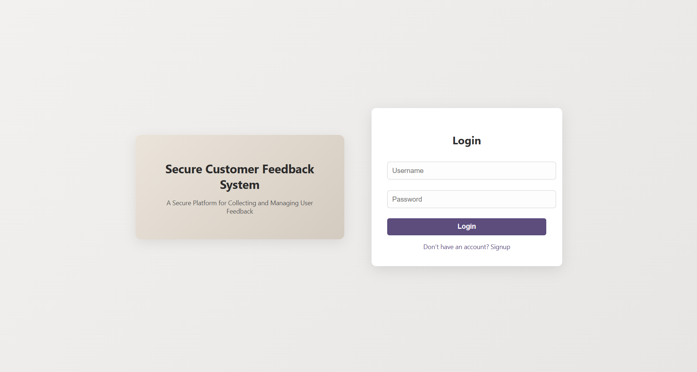
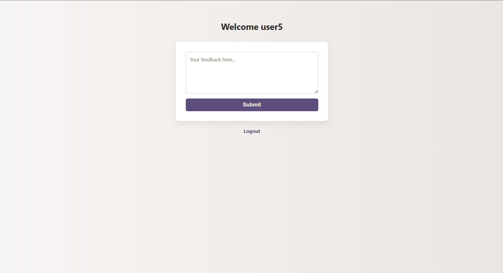
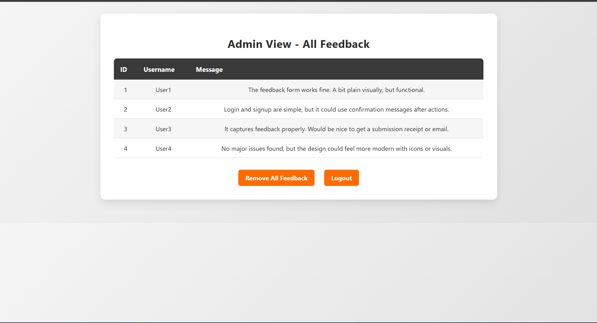

# Feedback App (Flask + SQLite)

A small web app for collecting and reviewing user feedback. It uses **Flask** for the web layer, **SQLAlchemy** as the ORM, **SQLite** for storage, and **Bcrypt** for password hashing. The code aims to be clear and minimal, showing practical CRUD over a relational schema.

## Features
- User signup and login
- Submit feedback
- Admin page to review or clear all feedback
- Lightweight CLI viewer to inspect the database

## Tech Stack
- Python, Flask, SQLAlchemy, Bcrypt
- SQLite (file-backed database)

## Prerequisites
- Python 3.9+
- (Optional) Virtual environment
  ```bash
  python -m venv venv
  # Windows
  venv\Scripts\activate
  # macOS/Linux
  source venv/bin/activate
  ```

## Setup
If you have a `requirements.txt`:
```bash
pip install -r requirements.txt
```
Otherwise:
```bash
pip install Flask Flask_SQLAlchemy Flask_Bcrypt tabulate
```

## Run
```bash
python app.py
```
Open: <http://127.0.0.1:5000>

> The database is created on first run at `instance/feedback.db` (a sample file may already exist).

## Database
- `user`: `id` (PK), `username` (UNIQUE), `password` (bcrypt hash)
- `feedback`: `id` (PK), `username`, `message`

Inspect data from the terminal:
```bash
python view_db.py
```
(Uses `sqlite3` + `tabulate` to print table contents.)

## Routes (high level)
- `/signup` – create a user (username + password)
- `/login` – authenticate and start a session
- `/logout` – clear the session
- `/feedback` – submit feedback (logged-in users)
- `/admin` – list all feedback (admin only)
- `/delete_feedback` – clear all feedback (admin only)

> “Admin” is treated by username: create a user named **admin** via signup, then log in to access `/admin`.

## Configuration
- `SECRET_KEY`: currently set in code for simplicity. For production, export an env var and read it in `app.py`:
  ```python
  app.secret_key = os.getenv("SECRET_KEY", "dev-secret")
  ```

## Project Structure
```
app.py
instance/
  feedback.db
static/
  style.css
templates/
  login.html
  signup.html
  feedback.html
  admin.html
view_db.py
```

## Screenshots





## Notes
- Passwords are hashed with **Bcrypt**; ORM queries go through **SQLAlchemy**.
- For a stricter schema, `feedback` can reference `user.id` (FK) instead of storing `username` directly.
